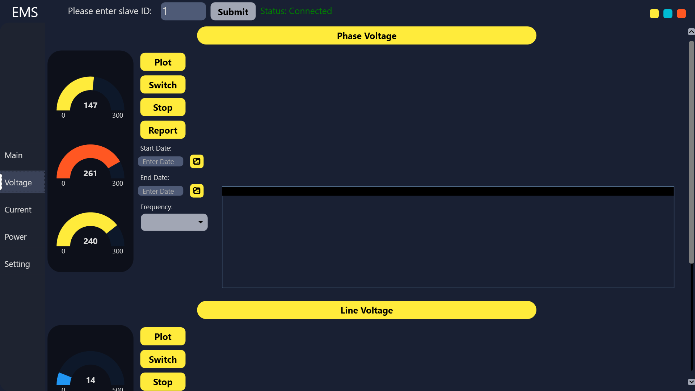

# Energy-Management-System
 An Energy Management System desktop application for remote energy monitoring via Modbus RTU TCP/IP communication protocol
---

# ⚡ Energy Management System

A Windows desktop application for remote energy monitoring using the **Modbus RTU over TCP/IP** protocol.

---

## 🔑 Features

1. **PAC3120 multimeter** connection via Modbus RTU over TCP/IP.
   *(Currently supports one device at a time, connected to a simulated local Modbus slave at `127.0.0.1`)*
2. **Real-time data visualization**
3. **Data logging** to a local **PostgreSQL** database
4. **Export functionality** to **CSV**
5. **User warnings** when values are outside defined thresholds
6. **Acknowledgement system** for alerts
7. **Configurable lower/upper thresholds**

---

## 🖼 Screenshots

| Main Page               | Voltage Page                 | Current Page                 |
| ----------------------- | ---------------------------- | ---------------------------- |
|  |  |  |

| Power Page                 | Setting Page                 | Voltage Graph + Report        |
| -------------------------- | ---------------------------- | ----------------------------- |
|  |  |  |

---

## ▶ How to Run the Application

### 1. Clone the Repository

```bash
git clone https://github.com/your-username/Energy-Management-System.git
```

---

### 2. Setup Modbus Simulator

* Download **OpenModSim**:
  [https://github.com/sanny32/OpenModSim/releases](https://github.com/sanny32/OpenModSim/releases)

* Run OpenModSim:

  1. Open the application.
  2. Go to **File → Open**.
  3. Navigate to the `Energy-Management-System` folder.
  4. Select the `ModSim1` file.

---

### 3. Install PostgreSQL & Create a Database

* Download **pgAdmin 4**:
  [https://www.pgadmin.org/download/pgadmin-4-windows/](https://www.pgadmin.org/download/pgadmin-4-windows/)

* Create the PostgreSQL Server:

  1. Open pgAdmin 4.
  2. In the **Browser panel**, right-click on `Servers` → **Create** → **Server...**
  3. Under the **General** tab:

     * Name: `EMS Server` (or any name)
  4. Under the **Connection** tab:

     * Host name/address: `localhost`
     * Port: `5432`
     * Maintenance database: `postgres`
     * Username: `postgres`
     * Password: `12345678`
  5. Click **Save**.

* Create the `EMS` Database:

  1. Expand the server you just created.
  2. Right-click on **Databases** → **Create** → **Database...**
  3. Name: `EMS`
  4. Owner: `postgres`
  5. Click **Save**.

---

### 4. Create Tables

1. In pgAdmin 4, go to:
   `Servers > EMS Server > Databases > EMS`
2. Right-click `EMS` → **Query Tool**
3. Click the folder icon (Open File) and choose:
   `Energy-Management-System/Database-Structure/CreateTable.sql`
4. Click the **Execute/Run** button.
5. Wait for "Query returned successfully".

---

### 5. (Optional) Insert 1 Year of Mock Data

1. Repeat the steps above using:
   `InsertIntoTableFor1Year.sql` from the same `Database-Structure` folder.

---

### 6. Run the Application

1. Navigate to:
   `Energy-Management-System/EMS`
2. Open `EMS.sln` with **Visual Studio**
3. Press `Ctrl + B` to build the solution
4. Press `Ctrl + F5` to run the application

---

## 📝 Notes

* Make sure the PostgreSQL server is running.
* Ensure that the OpenModSim slave is active and matches the expected register structure.
